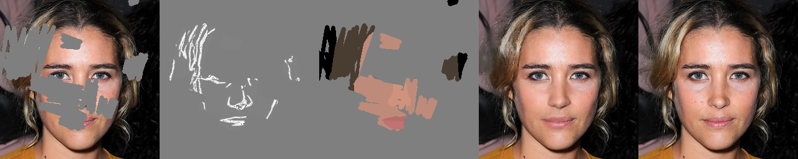

# Facial Features Manipulation Using Free-Form Input (PyTorch)



The developed model creates a faithful composition of an image with erased areas, sketch and colormap.


## Usage

```bash

usage: train.py [-h] [--dataset DATASET] [--num_workers NUM_WORKERS]
                     [--image_size IMAGE_SIZE] [--bbox_shape BBOX_SHAPE]
                     [--bbox_randomness BBOX_RANDOMNESS]
                     [--bbox_margin BBOX_MARGIN] [--bbox_max_num BBOX_MAX_NUM]
                     [--vis_dataset VIS_DATASET] [--overfit]
                     [--max_epoch MAX_EPOCH] [--save_epoch SAVE_EPOCH]
                     [--lr LR] [--weight_decay WEIGHT_DECAY] [--l1_c_h L1_C_H]
                     [--l1_c_nh L1_C_NH] [--l1_r_h L1_R_H] [--l1_r_nh L1_R_NH]
                     [--gen_loss_alpha GEN_LOSS_ALPHA]
                     [--disc_loss_alpha DISC_LOSS_ALPHA]
                     [--batch_size BATCH_SIZE] [--input_nc INPUT_NC]
                     [--experiment EXPERIMENT]
                     [--visualization_set VISUALIZATION_SET]
                     [--load_G LOAD_G] [--load_D LOAD_D]
```
Arguments:

```bash
  --dataset DATASET                         dataset name
  --num_workers NUM_WORKERS                 num workers
  --image_size IMAGE_SIZE                   input image size
  --bbox_shape BBOX_SHAPE                   random box size
  --bbox_randomness BBOX_RANDOMNESS         variation in box size
  --bbox_margin BBOX_MARGIN                 margin from boundaries for box
  --bbox_max_num BBOX_MAX_NUM               max num of boxes
  --vis_dataset VIS_DATASET                 images to be visualized after each epoch
  --overfit                                 overfit
  --max_epoch MAX_EPOCH                     number of epochs to train for
  --save_epoch SAVE_EPOCH                   save every nth epoch
  --lr LR                                   learning rate, default=0.001
  --weight_decay WEIGHT_DECAY               weight decay
  --l1_c_h L1_C_H                           reconstruction coarse weight for holes
  --l1_c_nh L1_C_NH                         reconstruction coarse weight for non-holes
  --l1_r_h L1_R_H                           reconstruction coarse weight for holes
  --l1_r_nh L1_R_NH                         reconstruction coarse weight for non-holes
  --gen_loss_alpha GEN_LOSS_ALPHA           reconstruction coarse weight for non-holes
  --disc_loss_alpha DISC_LOSS_ALPHA         reconstruction coarse weight for non-holes
  --batch_size BATCH_SIZE                   batch size
  --input_nc INPUT_NC                       number of input channels + mask
  --experiment EXPERIMENT                   experiment directory
  --visualization_set VISUALIZATION_SET     validation samples to be visualized
  --load_G LOAD_G                           path to pretrained generator weights
  --load_D LOAD_D                           path to pretrained discriminator weights
```

The defaults should give reasonable performance in most cases.


